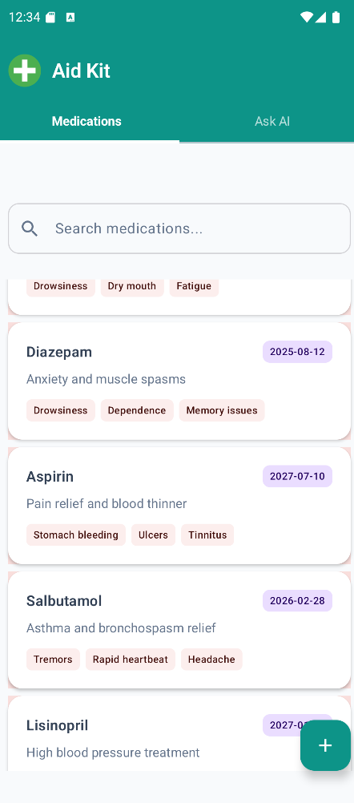
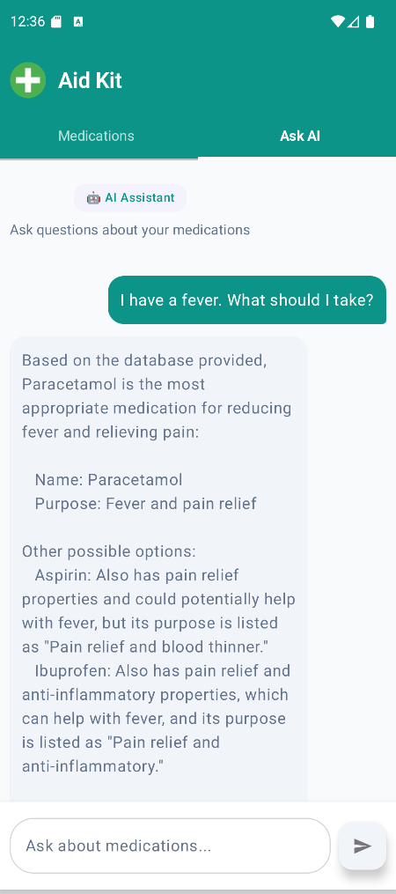

# 💊 Aid Kit Mobile

A modern Android mobile application for managing medications and getting AI-powered health assistance. Built with Jetpack Compose and Material Design 3.

## 📱 Features

### Medication Management
- **View Medications** - Browse your medication inventory with a clean, card-based UI
- **Add Medications** - Create new entries with name, purpose, expiry date, and side effects
- **Delete Medications** - Swipe-to-delete with confirmation dialog
- **Search** - Filter medications by name in real-time

### AI Assistant
- **ChatGPT-style Interface** - Ask questions about your medications
- **Context-Aware Responses** - AI uses your medication data to provide relevant answers
- **Powered by Ollama** - Local LLM integration for privacy-focused AI

## 🛠️ Tech Stack

| Layer | Technology |
|-------|------------|
| **UI Framework** | Jetpack Compose |
| **Design System** | Material Design 3 |
| **Language** | Kotlin |
| **Architecture** | Single Activity, Composable Functions |
| **Networking** | Retrofit 2 + OkHttp |
| **Serialization** | Gson |
| **Backend** | Spring Boot REST API |
| **Database** | Apache Cassandra |
| **AI** | Ollama (Local LLM) |

## 🎨 UI/UX Highlights

- **Modern Design** - Clean, medical-themed teal color palette
- **Dark Mode Support** - Full light/dark theme implementation
- **Responsive Cards** - Medication cards with expiry badges and side effect chips
- **Smooth Animations** - Tab transitions and swipe gestures
- **Intuitive Navigation** - Tab-based navigation between features

## 📂 Project Structure

```
app/src/main/java/com/jehan/aidkitmobile/
├── MainActivity.kt          # Main UI with all composables
├── interfaces/
│   ├── MedicationApi.kt     # Retrofit interface for medications
│   └── AiApi.kt             # Retrofit interface for AI chat
├── models/
│   └── Medication.kt        # Data class for medication
├── network/
│   └── RetrofitClient.kt    # Retrofit singleton with OkHttp
└── ui/theme/
    ├── Color.kt             # Custom color palette
    ├── Theme.kt             # Material 3 theme configuration
    └── Type.kt              # Typography definitions
```

## 🚀 Getting Started

### Prerequisites
- Android Studio Hedgehog or later
- JDK 11+
- Android SDK 24+ (minSdk)
- Running instance of the Aid Kit backend

### Setup

1. **Clone the repository**
   ```bash
   git clone https://github.com/yourusername/AidKitMobile.git
   ```

2. **Open in Android Studio**
   - File → Open → Select the project folder

3. **Configure Backend URL**
   - Update `BASE_URL` in `RetrofitClient.kt` if needed
   - Default: `http://10.0.2.2:8080/` (localhost from emulator)

4. **Run the app**
   - Select an emulator or physical device
   - Click Run (▶️)

## 🔗 API Endpoints

The app communicates with a Spring Boot backend:

| Method | Endpoint | Description |
|--------|----------|-------------|
| GET | `/api/medications` | Fetch all medications |
| POST | `/api/medications` | Create a new medication |
| DELETE | `/api/medications/{id}` | Delete a medication |
| POST | `/api/ai/ask/medication` | Ask AI about medications |

## 📸 Screenshots

 

## 🏗️ Architecture Decisions

- **Single Activity** - Leverages Compose navigation without fragments
- **State Hoisting** - Chat messages persist across tab switches
- **Coroutines** - All network calls use Kotlin coroutines with suspend functions
- **Material 3** - Latest Material Design components and theming

## TODO:
- Create a reminders to take certain pills. It should be in a seperate tab.

## 📄 License

This project is available for viewing and educational purposes.

